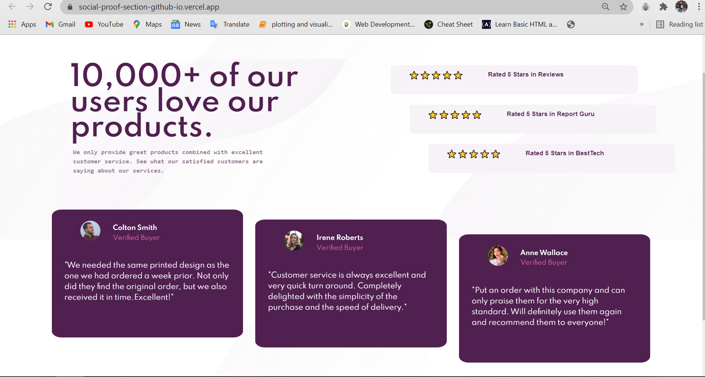

# Frontend Mentor - Social proof section
This is a solution to the [social proof section challenge on Frontend Mentor](https://www.frontendmentor.io/challenges/social-proof-section-6e0qTv_bA/hub/socialproofsection-YdwoPQoBD). Frontend Mentor challenges help you improve your coding skills by building realistic projects. 

## Table of contents

- [Overview](#overview)
- [The challenge](#the-challenge)
- [Screenshot](#screenshot)
- [Links](#links)
- [My process](#my-process)
- [Built with](#built-with)
- [What I learned](#what-i-learned)
- [Continued development](#continued-development)
- [Useful resources](#useful-resources)
- [Author](#author)

## Overview
Completed challenge using Bootstrap

### The challenge

Users should be able to:

- View the optimal layout depending on their device's screen size

### Screenshot



### Links

- Solution URL: [https://github.com/mansi05041/social-proof-section.github.io]
- Live Site URL: [https://social-proof-section-github-io.vercel.app/]

## My process

To make website responsive i have use bootstrap feature of column breakpoint at different viewport

### Built with

- Semantic HTML5 markup
- CSS custom properties
- Bootstrap
- Mobile-first workflow

### What I learned

```html
<section id='top-container'>
  <div>....</div>
<section id="bottom-container">
  <div>....</div>
```
I used two sections : top container & bottom container 

### Continued development

Improvement in Responsive Area

### Useful resources

- [w3schools](https://www.w3schools.com/css/css_rwd_mediaqueries.asp) - This helped me for understanding the media querry.
- [Bootstrap](https://getbootstrap.com) - Documentation helped me lot in bootstrap application.
## Author

- Frontend Mentor - [@mansi05041](https://www.frontendmentor.io/profile/mansi05041)
- Linkedin - [mansi joshi](https://www.linkedin.com/in/mansi-joshi-663aa81a0/)

